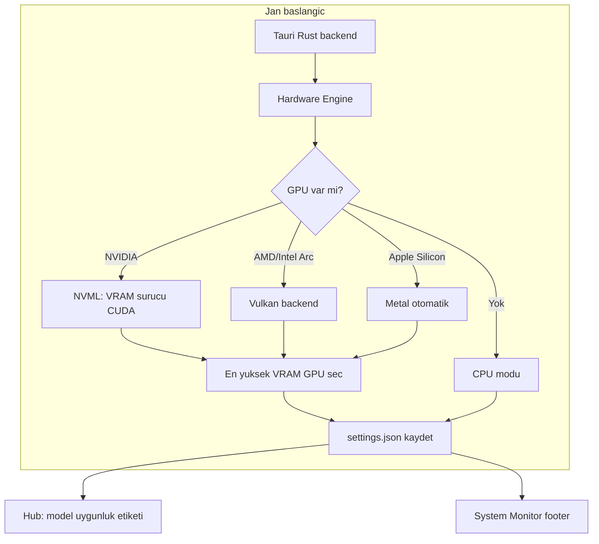
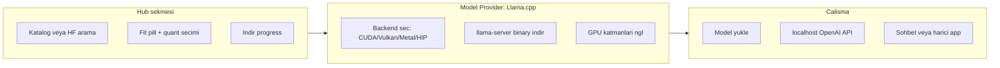
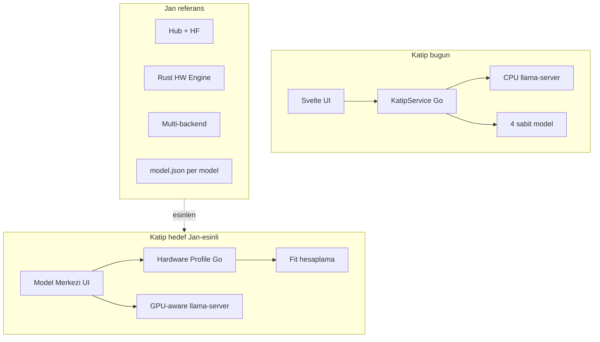

# Katip × Jan: LLM Altyapısı Karşılaştırması ve Aktarılabilir Özellikler

## Katip dokümantasyon özeti

Projede 5 markdown dosyası var; hepsi okundu:

| Dosya | Odak |
|-------|------|
| [README.md](README.md) | Vitrin, kurulum, özellik listesi, model kataloğu tablosu |
| [ARCHITECTURE.md](ARCHITECTURE.md) | llama-server subprocess, veri akışları, 26 Wails API, epik planları |
| [LLM.md](LLM.md) | AI asistanlar için token-verimli özet |
| [DESIGN.md](DESIGN.md) | UI/UX, renkler, bileşen stilleri |
| [.plan/yayin_takimi_gelistirme_plani.md](.plan/yayin_takimi_gelistirme_plani.md) | `.kitap`, RAG, `.tarz` editöryal vizyonu |

**Katip'in mevcut LLM felsefesi:** Metin düzenleyici odaklı, tamamen çevrimdışı, Go/Wails + Svelte. LLM katmanı ince: subprocess `llama-server`, sabit 4 model kataloğu, Setup Wizard, Ayarlar'dan manuel sunucu başlatma.

---

## Jan nasıl çalışıyor?

Jan ([janhq/jan](https://github.com/janhq/jan), [jan.ai](https://jan.ai)) bir **genel amaçlı yerel sohbet uygulaması**; Katip ise **Türkçe editöryal AI aracı**. LLM altyapısı açısından Jan'ın güçlü yanları şunlar:

### 1. Donanım tespiti (proaktif)

Jan açılışta ve gerektiğinde (uyku sonrası) donanımı profiller:



**Kaynaklar:** [Jan GPU acceleration issue #1851](https://github.com/janhq/jan/issues/1851), [hardware PR #4471](https://github.com/janhq/jan/pull/4471), [GPU refresh PR #7605](https://github.com/janhq/jan/pull/7605)

Jan'ın `settings.json` donanım profili örneği:
- `run_mode`: `"gpu"` | `"cpu"`
- `nvidia_driver`, `cuda` sürüm bilgisi
- `gpus[]`: id, name, vram, arch
- `gpu_highest_vram`, `gpus_in_use[]`
- `vulkan` bayrağı

**Davranış kuralları:**
- Uyumlu GPU varsa hızlandırma **varsayılan açık**; en yüksek VRAM'li GPU seçilir
- Aynı tipte çoklu GPU seçilebilir (farklı tipler karıştırılamaz)
- GPU yoksa toggle **kilitli** (açılamaz)
- Footer'da CPU/RAM/VRAM kullanımı canlı izlenir
- Uyku sonrası NVML cache invalidation + manuel "Yenile" butonu

### 2. Model uygunluk hesabı (indirmeden önce)

Jan Hub'da her model için **Fit pill** gösterir ([manage-models docs](https://github.com/janhq/jan/blob/dev/docs/src/pages/docs/desktop/manage-models.mdx), [local-models](https://janhq-jan-19.mintlify.app/features/local-models)):

| Etiket | Anlam |
|--------|-------|
| **Fits** | RAM + VRAM yeterli |
| **May be slow** | Çalışır ama yavaş (CPU veya sınırda VRAM) |
| **Won't fit** | Yetersiz bellek |

- Quantization grupları: **Small / Balanced / Large** + **Recommended** etiketi
- Hesaplama **veri indirmeden** yapılır (dosya boyutu + donanım profili)
- Kural örneği (troubleshooting): 8 GB RAM → ~6 GB altı model; 16 GB → ~13 GB altı; VRAM'in %80'ini aşmama

### 3. Tek arayüz: Hub + Engine + Model

Jan üç katmanı birleştirir:



**Model kaynakları:**
- [janhq/model-catalog](https://github.com/janhq/model-catalog): HF'den otomatik güncellenen JSON katalog
- HF model ID ile arama (`TheBloke/Mistral-7B-GGUF`)
- Yerel GGUF import (link veya kopyala)
- Model başına `model.json`: ctx_len, prompt_template, temperature, ngl

**Inference engine stratejisi** ([issue #4941](https://github.com/janhq/jan/issues/4941)):
- llama-server uygulamayla **gönderilmez**; ilk kullanımda indirilir
- Platforma göre CUDA / Vulkan / Metal / HIP binary
- Kullanıcı backend klasörünü değiştirebilir (ör. AMD HIP manuel kurulum)

### 4. Jan'ın diğer dikkat çeken özellikleri

| Özellik | Jan | Katip'te durum |
|---------|-----|----------------|
| OpenAI API sunucusu (localhost:1337) | Var, harici app'ler bağlanır | Yok (yalnızca iç kullanım) |
| Streaming token UI | Sohbet akışı | Backend SSE var; editörde paragraf bazlı |
| Model silme / disk yönetimi | Delete All, per-model delete | Yok |
| HF Access Token | Ayarlarda | Yok |
| Otomatik sunucu başlatma | Uygulama açılışında | Manuel (Ayarlar) |
| Inference parametreleri UI | temperature, max_tokens, ngl slider | Kodda sabit (temp 0.15) |
| Cloud provider (OpenAI, Claude) | Var | Kapsam dışı (gizlilik vizyonu) |
| MCP / araçlar | Var | Yok |
| Sohbet geçmişi / assistant | Var | Yok (editör odaklı — kasıtlı) |

---

## Katip'in mevcut LLM altyapısı (kod gerçekleri)

### Güçlü yanlar (Jan'dan iyi veya eşdeğer)

- **Cross-platform llama-server indirme** — [downloader.go](internal/llm/downloader.go): GitHub Releases, zip çıkarma, platform asset seçimi
- **Model indirme resume** — `.part` + Range header ([models.go](internal/llm/models.go))
- **Setup Wizard** — eksik bileşen tespiti, zip_found, model_partial durumları
- **Reaktif hata sınıflandırma** — [manager.go](internal/llm/manager.go) `analyzeServerLog()`: BELLEK_YETERSIZ, MODEL_BOZUK, PORT_KULLANILIYOR
- **Editöryal AI katmanı** — modlar (fix/shorten/flow/formal), RAG özeti, `.tarz`, review paneli, streaming + iptal — Jan'da **yok**

### Kritik boşluklar (Jan'ın üstün olduğu alanlar)

1. **Yalnızca CPU binary** — `downloader.go` satır 122-125: `cuda`, `vulkan`, `sycl`, `hip` bilinçli filtreleniyor
2. **Donanım profilleme yok** — RAM/VRAM/CPU çekirdek okunmuyor; `threads: 4` sabit
3. **Model kataloğu statik** — 4 model, quant seçimi yok, HF arama yok
4. **Aktif model seçimi zayıf** — son indirilen otomatik seçilir; UI'da "kullan" butonu yok
5. **Uygunluk etiketi yok** — `MinRAM` yalnızca gösterim metni, hesaplanmıyor
6. **GPU katmanları (`-ngl`) yok** — manager args: `-m -c -t` only
7. **Sunucu manuel başlatılır** — kullanıcı header kırmızı ışık görür

---

## Katip'e aktarılabilir özellikler (öncelik sırasıyla)

### P0 — Yüksek etki, Katip vizyonuyla uyumlu

**1. Donanım profilleme modülü (Go)**

Yeni paket: `internal/hardware/` (veya `internal/llm/hardware.go`)

- **RAM toplam / kullanılabilir:** `gopsutil` veya platform API (Windows: GlobalMemoryStatusEx, Linux: /proc/meminfo, macOS: sysctl)
- **CPU çekirdek sayısı** → `config.Threads` otomatik ayar
- **GPU tespiti (basit faz):**
  - Windows: `nvidia-smi` parse veya WMI
  - macOS: Metal varsayılan (arm64)
  - Linux: `/proc/driver/nvidia/gpus` veya `nvidia-smi`
- Wails API: `GetHardwareProfile()` → `{ totalRAM, availableRAM, cpuCores, gpus[], recommendedBackend }`

Jan'ın Rust/NVML karmaşıklığının **hafif Go eşdeğeri** yeterli; uyku sonrası refresh ikinci fazda.

**2. Akıllı backend seçimi**

[downloader.go](internal/llm/downloader.go) `findAssetName()` genişlet:

| Platform | Öncelik | Asset pattern |
|----------|---------|---------------|
| Windows + NVIDIA | CUDA | `win-cuda-x64` |
| Windows + AMD/Intel | Vulkan | `win-vulkan-x64` |
| macOS arm64 | Metal | `mac-arm64` (mevcut) |
| Linux + NVIDIA | CUDA | `ubuntu-cuda-x64` |
| Fallback | CPU | mevcut `win-cpu-x64` vb. |

Setup Wizard ve Settings'te: "Önerilen: CUDA (RTX 3060, 12 GB VRAM)" gibi Türkçe etiket.

**3. Model Hub UI (tek arayüz)**

[SettingsDialog.svelte](frontend/src/lib/components/SettingsDialog.svelte) yerine veya içinde **Model Merkezi** sekmesi:

- Katalog kartları + **Uygunluk rozeti** (Sığar / Yavaş olabilir / Sığmaz)
- İndir → Kurulu → **Kullan** (aktif model değiştir + sunucu yeniden başlat)
- Quant seçimi (aynı modelin Q4/Q5/Q8 varyantları katalogda)
- Disk kullanımı gösterimi

Backend: `ModelInfo`'ya `fitStatus`, `recommendedQuant` alanları; `SelectModel(modelID)` API.

**4. GPU katmanları ve engine ayarları**

[manager.go](internal/llm/manager.go) args'a `-ngl` ekle; `AppConfig`'e:

```go
GPULayers   int    `json:"gpuLayers"`   // -1 = max
Backend     string `json:"backend"`     // cpu|cuda|metal|vulkan
AutoStart   bool   `json:"autoStartLLM"`
```

Jan'daki per-model `model.json` yerine Katip'te `config.json` + isteğe bağlı `models/<id>.meta.json` yeterli (editör tek aktif model kullanır).

**5. Kurulum sihirbazında donanım odaklı öneri**

[SetupWizard.svelte](frontend/src/lib/components/SetupWizard.svelte):

- Adım 0: Donanım özeti (RAM, GPU, önerilen model)
- Varsayılan modeli donanıma göre seç: 8 GB altı → Qwen2.5-3B; 16 GB+ → Turkcell-7B
- Jan'daki "Won't fit" durumunda alternatif model otomatik öner

### P1 — Orta etki

**6. Sistem monitörü (header/footer)**

Jan footer'ının editör odaklı versiyonu: AI çalışırken RAM/VRAM bar; [App.svelte](frontend/src/App.svelte) header'daki durum ışığının yanında hover tooltip.

**7. HuggingFace model ID ile import**

Sabit kataloga ek: kullanıcı HF repo ID yapıştırır → GGUF dosya listesi parse → indir. HF token desteği gated modeller için.

**8. Model yönetimi**

- `DeleteModel(modelID)`, `GetDiskUsage()`
- Kurulu modeller arası hızlı geçiş (sunucu restart ile)

**9. Otomatik LLM başlatma**

`CheckSetupStatus() === ready` + `autoStartLLM` → `StartLLMServer()` on mount.

**10. Inference parametreleri (sınırlı)**

Editör için Jan'ın tam sohbet ayarları gerekmez; ancak Ayarlar'da:
- `temperature`, `max_tokens` (config'e taşı)
- Mod bazlı override (formal → düşük temp) mevcut yapıyla uyumlu

### P2 — Düşük öncelik / seçmeli

**11. Dinamik model kataloğu** — [janhq/model-catalog](https://github.com/janhq/model-catalog) benzeri JSON; Katip için **Türkçe odaklı filtrelenmiş** alt küme (Turkcell, OpenR1, yerel fine-tune'lar)

**12. Yerel GGUF dosya seçici** — README'de "harici GGUF seçilebilir" deniyor; native file dialog + symlink

**13. OpenAI uyumlu yerel API** — Jan gibi `localhost:PORT` dışarı açma; Katip için düşük öncelik (editör odaklı)

**14. Backend sürüm yöneticisi** — Jan'daki "llama.cpp klasörü seç" (power user); Katip'te Gelişmiş Ayarlar altında

### Katip'e aktarılmaması gerekenler

| Jan özelliği | Neden |
|--------------|-------|
| Sohbet UI / thread geçmişi | Ürün farklı; Katip editör + review paneli |
| Cloud API (OpenAI, Claude) | Çevrimdışı/gizlilik vizyonu |
| MCP / agent araçları | Epik kapsamı dışı; `.kitap` + RAG yeterli |
| Vision / tool calling | Metin editörü odaklı; gelecekte değerlendirilebilir |
| Tam model-catalog mirror | Bakım yükü; Türkçe kürasyonlu alt küme daha mantıklı |

---

## Mimari karşılaştırma



---

## Önerilen uygulama fazları

### Faz A — Donanım + backend (2-3 hafta)
- `GetHardwareProfile()` Go API
- `findAssetName()` GPU-aware genişletme
- `-ngl`, otomatik `threads`
- Setup Wizard donanım özeti

### Faz B — Model Merkezi (2 hafta)
- Fit rozeti hesaplama
- Aktif model seçimi + silme
- Quant varyantları katalogda
- Otomatik sunucu başlatma

### Faz C — Gelişmiş (isteğe bağlı)
- HF ID import, dinamik katalog JSON
- Sistem monitörü, backend sürüm seçici
- Uyku sonrası GPU refresh (Jan PR #7605 benzeri)

---

## Sonuç

Jan'ın Katip'e en değerli katkısı **sohbet arayüzü değil**, şu üçlüdür:

1. **Proaktif donanım profilleme** → doğru backend ve model önerisi
2. **Hub + fit pill** → kullanıcı indirmeden önce "bu cihazda çalışır mı?" bilir
3. **GPU hızlandırma + ngl** → 7B Türkçe modelde kabul edilebilir gecikme

Katip'in Jan'dan **üstün** kaldığı alanlar korunmalı: paragraf diff/review, `.tarz`, RAG tutarlılık, hunspell, editöryal modlar, `.kitap` paket vizyonu. Jan'dan alınacak parçalar bu editöryal çekirdeği destekleyen **altyapı katmanı** olmalı; ürünü sohbet uygulamasına dönüştürmemeli.

**Referanslar:**
- [Jan GitHub](https://github.com/janhq/jan)
- [Jan model yönetimi docs](https://github.com/janhq/jan/blob/dev/docs/src/pages/docs/desktop/manage-models.mdx)
- [Jan local models](https://janhq-jan-19.mintlify.app/features/local-models)
- [Jan model-catalog](https://github.com/janhq/model-catalog)
- [Jan llama.cpp geçişi #4941](https://github.com/janhq/jan/issues/4941)
